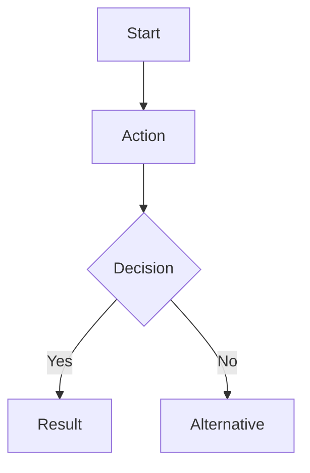

# .shared Folder Collaboration Spec

Agent collaboration through standardized output files.

## Purpose

Enable seamless handoff between agents by:
- Standardizing output locations
- Defining file schemas
- Establishing naming conventions

## Folder Structure

```
[target-repository]/
└── .shared/
    ├── 01-requirements.md
    ├── 02-wireframes.md
    ├── 03-ux-specification.md
    ├── 04-tech-architecture.md
    ├── 05-flow-diagrams.md
    ├── 06-animations.md
    ├── 07-roadmap.md
    └── 08-qa-report.md
```

## File Schemas

### 01-requirements.md (Interviewer)

```markdown
---
agent: interviewer
created: [timestamp]
---

# Requirements

## Problem Statement
[Clear problem definition]

## Target Users
[User personas]

## Features
### Must-Have
- [Feature 1]

### Should-Have
- [Feature 2]

### Could-Have
- [Feature 3]

## Constraints
- [Constraint 1]

## Success Criteria
- [Criterion 1]
```

### 02-wireframes.md (UI Sketcher)

```markdown
---
agent: ui-sketcher
created: [timestamp]
input: [01-requirements.md]
---

# Wireframes

## Screen: [Name]
### Layout
```
[ASCII wireframe]
```

### Tailwind Hints
- Container: `max-w-4xl mx-auto`
- [Component]: `[classes]`

### Interactions
- [Element]: [behavior]
```

### 03-ux-specification.md (UX Spec Writer)

```markdown
---
agent: ux-spec-writer
created: [timestamp]
input: [01-requirements.md, 02-wireframes.md]
---

# UX Specification

## User Stories
- As a [user], I want to [action], so that [benefit]

## UX Principles Applied
### Visibility (Norman)
[How principle applies]

### Feedback (Nielsen)
[How principle applies]

## Acceptance Criteria
- [ ] [Criterion]

## Design System
### Colors
- Primary: [color]

### Typography
- Headings: [font/size]
```

### 04-tech-architecture.md (Client Tech Architect)

```markdown
---
agent: client-tech-architect
created: [timestamp]
input: [01-requirements.md, 03-ux-specification.md]
---

# Technical Architecture

## Storage Strategy
### LocalStorage
- Settings: [key-value pairs]

### IndexedDB (localbase)
- [Collection]: [purpose]

## Data Model
### [Entity]
```typescript
interface [Entity] {
  id: string
  [field]: [type]
}
```

## Repository Classes
[Code examples]
```

### 05-flow-diagrams.md (Mermaid Designer)

```markdown
---
agent: mermaid-designer
created: [timestamp]
input: [01-requirements.md, 03-ux-specification.md]
---

# User Flow Diagrams

## [Flow Name]


### Key Decision Points
- [Decision]: [criteria]
```

### 06-animations.md (Interactive Designer)

```markdown
---
agent: interactive-designer
created: [timestamp]
input: [02-wireframes.md, 03-ux-specification.md]
---

# Animation Specifications

## Buttons
### Hover State
```html
<button class="transition-all duration-200 hover:scale-105 hover:shadow-lg">
```

## Transitions
### Page Load
- Duration: 300ms
- Easing: ease-out
```

### 07-roadmap.md (Planner)

```markdown
---
agent: planner
created: [timestamp]
input: [all previous files]
---

# Development Roadmap

## MoSCoW Prioritization
| Feature | Priority | Effort |
|---------|----------|--------|
| [Feature] | Must | [S/M/L] |

## Phases
### Phase 1: MVP
- [ ] [Task 1]
- [ ] [Task 2]

## Milestones
| Milestone | Criteria |
|-----------|----------|
| MVP | [criteria] |
```

### 08-qa-report.md (Browser QA)

```markdown
---
agent: browser-qa
created: [timestamp]
input: [all previous files]
---

# QA Report

## Test Summary
| Category | Pass | Fail |
|----------|------|------|
| Functionality | [n] | [n] |
| UI/UX | [n] | [n] |

## Test Results
### [Test Case]
- Status: Pass/Fail
- Notes: [observations]

## Issues Found
| Issue | Severity | Description |
|-------|----------|-------------|
| [ID] | [High/Med/Low] | [description] |

## Screenshots
- [screenshot references]
```

## Dependency Graph

```
01-requirements
    ↓
02-wireframes
    ↓
03-ux-specification
    ↓
    ├── 04-tech-architecture
    ├── 05-flow-diagrams
    └── 06-animations
            ↓
        07-roadmap
            ↓
        08-qa-report
```

## Usage

### Creating Output
```javascript
// Agent writes to .shared folder
Write('.shared/01-requirements.md', content)
```

### Reading Input
```javascript
// Next agent reads previous output
Read('.shared/01-requirements.md')
Read('.shared/02-wireframes.md')
```

## Cleanup

The `.shared/` folder should be:
- Added to `.gitignore` (generated files)
- Cleared before starting new consultation
- Preserved during active consultation
